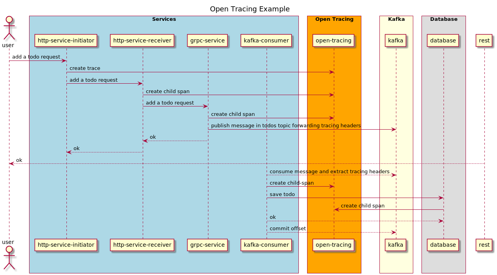

# go-opentracing-example

End-to-end go [opentracing](https://opentracing.io/) example using [jaeger](https://github.com/jaegertracing/jaeger) as tracer.

This example shows how to leverage open tracing to see a span that covers the following flow:

As you can see:
 - a span is started by performing an HTTP request to the `http-sever-initiator` that calls `http-sever-receiver` over HTTP in turn
 - `http-sever-receiver` calls `grpc-server` over GRPC after having registered a child span
 - `grpc-server` publishes a message into kafka and returns a successful response upstream after having registered a child span
 - `kafka-consumer` consumes the message from the `todos` topic and creates a new record in the `todos` table. 
   It creates two spans: one for the time spent in the whole consumer logic and one for the time spent during the database query.
   
## How to run
You can run the project using `docker-compose up` (tbd)

## TODOS
 - Write solid documentation.